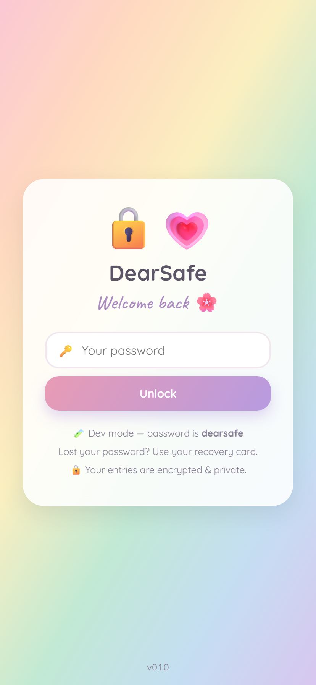
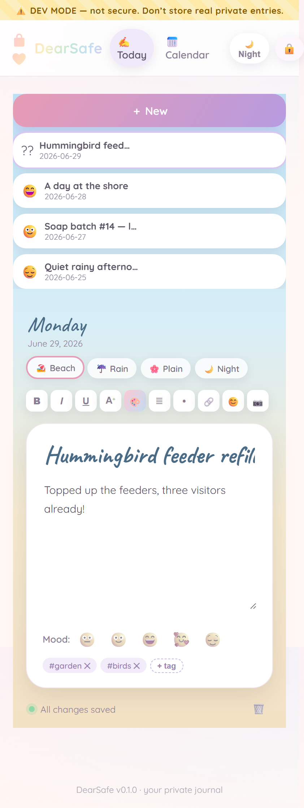
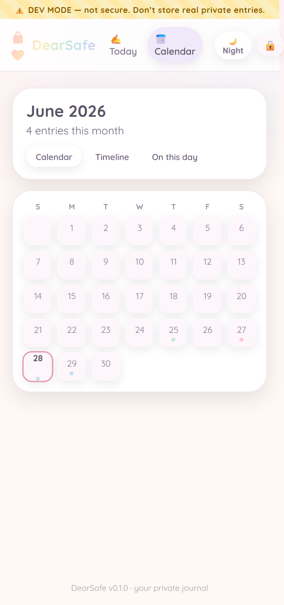

<div align="center">

# DearSafe 🔒💗

**A private, encrypted, pastel journaling app for your life _and_ your projects.**

[](./CHANGELOG.md)
[](./LICENSE)
[](#roadmap)
[](#)

_Write like in Word, drop photos right into your words, lock it all behind real encryption,_
_and make every day look like the day it was. Self-hosted. Yours alone._

</div>

---

## ✨ Why DearSafe

|  |  |
| --- | --- |
| 🔒 **Truly private** | Entries are encrypted at rest — unreadable to anyone but you, even the server owner. |
| 🖼️ **Visual storyboard** | Photos, short video & voice notes live _inline_ with your text. |
| 🎨 **Pretty & personal** | Soft pastel themes per entry (beachy, cozy rain…), light & dark mode. |
| ✍️ **Rich text + emoji** | Bold, italics, colors, fonts, lists — plus 😊🌸. |
| 🏷️ **Organize naturally** | Tags instead of folders; fast search across words & tags. |
| 📝 **One-click templates** | Reusable layouts you build (a soap-batch recipe, a daily standup). |
| 📅 **Date-aware** | Auto-dated entries, calendar + timeline, "on this day". |
| 🌍 **Works anywhere** | Any browser; installs to your phone as a PWA. No app store. |

> [!NOTE]
> **Real encryption means no backdoor.** If you lose _both_ your password and your recovery
> card, your entries can't be recovered — by anyone. That's the point. Setup walks you
> through saving the card. [More on security ›](docs/security.md)

## 📸 Screens

> _Screenshots are generated from the live app and added as the UI lands._

| Lock screen | Today / Editor | Calendar |
| --- | --- | --- |
|  |  |  |

## 🚀 Quick start

```bash
git clone https://github.com/dmpotter1361/DearSafe.git
cd DearSafe
cp .env.example .env        # set JWT_SECRET (and PORT if you like)
docker compose up -d --build
# open http://localhost:3600
```

Put it behind HTTPS with the built-in **Caddy** profile (auto Let's Encrypt):

```bash
# set DOMAIN + COOKIE_SECURE=true + APP_BASE_URL in .env, then:
docker compose --profile https up -d --build
```

<details>
<summary><b>Local development</b></summary>

```bash
cd server && npm install && npm run dev    # API on :3600
cd client && npm install && npm run dev    # Vite UI, proxies /api
```

Set `DEARSAFE_DEV=true` in `.env` for an easy shared login + seed data while testing.
**Never put real private entries in a dev instance.**
</details>

## 🧩 Tech

React 19 + Vite · Node + Express (ESM) · SQLite · AES-256-GCM at rest · single Docker
image · optional Caddy HTTPS. _(Mirrors the [DoughNotes] self-hosting pattern.)_

## 🗺️ Roadmap

**v0.1 (MVP):** encrypted entries · rich text + emoji · inline photos/video/audio ·
pastel themes (light & dark) · tags + search · templates · mood · calendar & timeline ·
trash/undo · `.ics` calendar feed · installable PWA.

**Later:** photo-text search (OCR) · full Google Calendar sync · offline writing · export ·
stats · reminders · weather · maps · stickers · collections.

## 📄 License

[GPL-3.0](./LICENSE) — free to use, clone, and self-host.

[DoughNotes]: https://github.com/dmpotter1361/DoughNotes
